# AWS SNS + SQS Fan-out 패턴 실습

## 1 AWS SNS, SQS

### AWS SNS (Simple Notification Service)

**SNS**는 발행/구독(Pub/Sub) 모델의 메시징 서비스로, 하나의 이벤트를 여러 구독자에게 동시에 전달하는 "Event Broadcaster" 역할을 수행

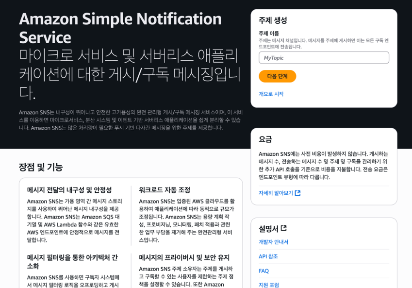

### 작동 방식

```
[Publisher] → [SNS Topic] → [Subscriber 1]
                          → [Subscriber 2]
                          → [Subscriber 3]
```

- **Publisher**: SNS Topic에 메시지를 발행
- **Topic**: 메시지를 받아 여러 구독자에게 전달
- **Subscriber**: Topic을 구독하여 메시지를 수신 (SQS, Lambda, HTTP 등)

### 특징

- **Fan-out 패턴**: 하나의 메시지가 여러 구독자에게 동시 전달
- **느슨한 결합**: Publisher는 구독자에 대한 정보 없이 메시지 발행 가능
- **확장성**: 구독자 추가/제거가 용이
- **다양한 프로토콜**: SQS, Lambda, HTTP/HTTPS, Email, SMS 등 지원

### 사용 사례

- 이벤트 기반 아키텍처
- 마이크로서비스 간 통신
- 알림 시스템 (Email, SMS, Push)
- 로그/메트릭 수집

### AWS SQS (Simple Queue Service)

**SQS**는 완전 관리형 메시지 큐 서비스로, 애플리케이션 간 메시지를 안전하게 전달하고 저장하는 "Mailbox" 역할을 수행

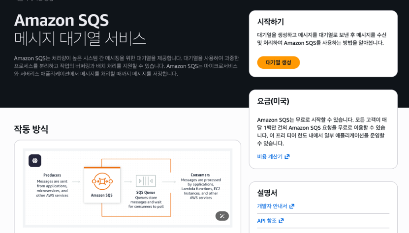

### 작동 방식

```
[Producer] → [SQS Queue] → [Consumer]
메시지 발행    메시지 저장    메시지 수신 및 처리
```

- **Producer**: SQS 대기열에 메시지 전송
- **Queue**: 메시지를 안전하게 저장
- **Consumer**: 대기열에서 메시지를 폴링하여 처리
- **처리 완료**: 메시지 삭제

### 특징

- **비동기 통신**: 시스템 간 느슨한 결합으로 독립적인 확장 가능
- **장애 격리**: 한 서비스의 장애가 다른 서비스에 전파되지 않음
- **메시지 지속성**: 메시지가 안전하게 보관되며 재시도 가능

### 대기열 타입 2가지

**1. 표준 대기열 (Standard Queue)**

- 거의 무제한 처리량
- 최소 1회 전달 (At-least-once delivery)
- 순서 보장 안 됨 (Best-effort ordering)
- 저렴한 비용

**2. FIFO 대기열 (First-In-First-Out Queue)**

- 정확한 순서 보장
- 정확히 1회 전달 (Exactly-once processing)
- 초당 300건 (배치: 3,000건)
- Standard Queue보다 높은 비용

### 사용 사례

- **마이크로서비스 간 통신**
  - 주문 서비스 → SQS → 결제 서비스 → SQS → 배송 서비스

- **작업 대기열**
  - 이미지 업로드 → SQS → 이미지 처리 Worker
  - 비디오 업로드 → SQS → 인코딩 Worker

- **버퍼링 및 부하 분산**
  - 트래픽 급증 → SQS (버퍼링) → 안정적인 처리

- **이벤트 기반 아키텍처**
  - 사용자 가입 → SQS → [이메일 발송, CRM 등록, 분석 전송]

---

### Fan-out 패턴 소개

**Fan-out 패턴**은 하나의 이벤트를 여러 서비스에 동시에 전달하는 아키텍처 패턴으로 SNS와 SQS를 결합하여 구현할 수 있음

```
[Order Service] --Publish--> [SNS Topic] --Fan-out--> [SQS:Payment]
                                               |---> [SQS:Stock]
                                               |---> [SQS:Notification]
```

1. **Order Service**: 주문 생성 이벤트를 SNS Topic에 발행
2. **SNS Topic**: 메시지를 받아 구독된 모든 SQS Queue에 자동 전달
3. **각 SQS Queue**: 독립적으로 메시지를 저장
4. **각 Consumer Service**: 자신의 Queue에서 메시지를 폴링하여 처리

#### 장점

- **독립성**: 각 서비스가 독립적으로 메시지를 처리
- **장애 격리**: 한 서비스의 실패가 다른 서비스에 영향 없음
- **확장성**: 각 서비스가 독립적으로 스케일링 가능
- **유연성**: 새로운 구독자 추가가 용이

---

## 2. 프로젝트 개요

### 실습 시나리오: 주문 처리 시스템

주문 생성 → SNS Topic 발행 → Fan-out으로 3개 SQS Queue에 동시 전달 → 각 서비스가 독립적으로 처리

```
┌─────────────────┐      ┌──────────────┐      ┌──────────────────┐
│  Order Service  │ ───> │  AWS SNS     │ ───> │ Payment Service  │
│   (Producer)    │      │   Topic      │      │   (Consumer)     │
│   Port 8080     │      │              │      │   Port 8081      │
└─────────────────┘      └──────┬───────┘      └──────────────────┘
                                  │
                                  │ Fan-out
                                  ├──────────────────┐
                                  │                  │
                                  ↓                  ↓
                         ┌──────────────────┐  ┌──────────────────┐
                         │  Stock Service   │  │Notification      │
                         │   (Consumer)     │  │  Service         │
                         │   Port 8082      │  │ (Consumer)       │
                         └──────────────────┘  │ Port 8083        │
                                                └──────────────────┘
```

### 프로젝트 구조

```
sns-sqs-demo/
├── order-service/          # 주문 생성 및 SNS 발행 (Producer)
│   ├── controller/         # REST API 엔드포인트
│   ├── service/            # 주문 생성 및 SNS Publisher
│   └── resources/
│       └── application.yml
├── payment-service/        # 결제 처리 (Consumer)
│   ├── service/            # SQS Consumer
│   └── resources/
│       └── application.yml
├── stock-service/          # 재고 관리 (Consumer)
│   ├── service/            # SQS Consumer
│   └── resources/
│       └── application.yml
└── notification-service/   # 알림 발송 (Consumer)
    ├── service/            # SQS Consumer
    └── resources/
        └── application.yml
```

---

## 3. 아키텍처 및 작동 방식

### 전체 아키텍처

```
┌──────────────────┐
│  Order Service   │
│   (Port 8080)     │
│                   │
│  POST /api/orders │
└────────┬──────────┘
         │
         │ 1. 주문 생성 및 SNS 발행
         ↓
┌──────────────────┐
│   SNS Topic       │
│ order-event-topic │
└────────┬──────────┘
         │
         │ 2. Fan-out (자동으로 3개 Queue에 전달)
         ├─────────────────┬─────────────────┐
         ↓                 ↓                 ↓
┌──────────────┐  ┌──────────────┐  ┌──────────────┐
│ Payment Queue│  │  Stock Queue │  │Notification  │
│              │  │              │  │    Queue     │
└──────┬───────┘  └──────┬───────┘  └──────┬───────┘
       │                 │                 │
       │ 3. 메시지 폴링  │ 3. 메시지 폴링  │ 3. 메시지 폴링
       ↓                 ↓                 ↓
┌──────────────┐  ┌──────────────┐  ┌──────────────┐
│Payment Service│  │Stock Service │  │Notification  │
│ (Port 8081)   │  │ (Port 8082)  │  │  Service     │
│               │  │              │  │ (Port 8083)   │
│ 결제 처리      │  │ 재고 업데이트 │  │ 알림 발송     │
└───────────────┘  └──────────────┘  └──────────────┘
```

### 작동 방식

1. **주문 생성**: 클라이언트가 `POST /api/orders` 요청
2. **SNS 발행**: Order Service가 주문 정보를 SNS Topic에 발행
3. **Fan-out**: SNS가 자동으로 3개 SQS Queue에 메시지 전달
4. **메시지 수신**: 각 Consumer Service가 자신의 Queue에서 메시지 폴링 (5초마다)
5. **처리**: 각 서비스가 독립적으로 비즈니스 로직 처리
6. **메시지 삭제**: 처리 완료 후 Queue에서 메시지 삭제

## 4. 실습 가이드

### AWS 리소스 생성

#### AWS 콘솔 접속 및 리전 설정

1. 브라우저에서 [AWS 콘솔](https://console.aws.amazon.com/) 접속
2. AWS 계정으로 로그인
3. 우측 상단의 리전 선택 드롭다운에서 **ap-northeast-2 (서울)** 선택
   - 모든 리소스는 동일한 리전에 생성해야 함

#### SNS Topic 생성

1. AWS 콘솔 상단 검색창에 **"SNS"** 입력
2. **Simple Notification Service** 선택
3. 왼쪽 메뉴에서 **"Topics"** 클릭
4. 우측 상단 **"Create topic"** 버튼 클릭
5. **Create topic** 페이지에서 설정
   - **Type**: **Standard** 선택
   - **Name**: `order-event-topic` 입력
6. 하단 **"Create topic"** 버튼 클릭
7. 생성된 Topic의 **ARN** 복사
   - 예: `arn:aws:sns:ap-northeast-2:123456789012:order-event-topic`

#### SQS Queue 생성 (3개)

1. AWS 콘솔 상단 검색창에 **"SQS"** 입력
2. **Simple Queue Service** 선택
3. 왼쪽 메뉴에서 **"Queues"** 클릭
4. **"Create queue"** 버튼 클릭하여 다음 Queue 생성:

**Payment Queue:**
- **Name**: `payment-queue`
- **Receive message wait time**: **20초** (Long Polling)

**Stock Queue:**
- **Name**: `stock-queue`
- **Receive message wait time**: **20초**

**Notification Queue:**
- **Name**: `notification-queue`
- **Receive message wait time**: **20초**

생성 후 각각 URL 복사

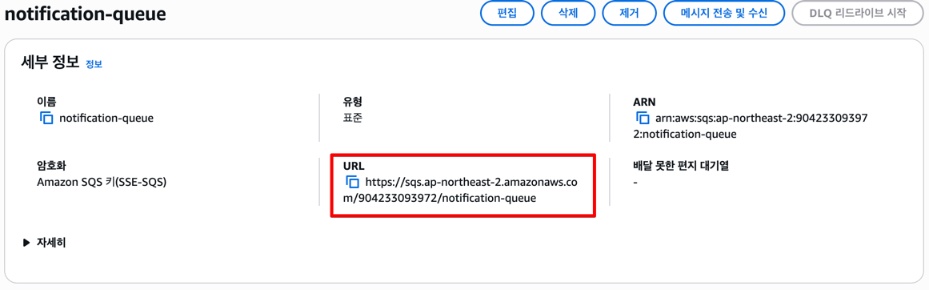


#### SNS Topic에 SQS Queue 구독 추가

1. **SNS** 서비스로 이동
2. **Topics** → `order-event-topic` 클릭

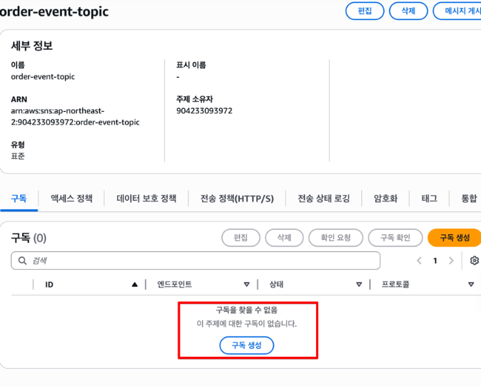

3. **"Subscriptions"** 탭 클릭
4. **"Create subscription"** 버튼 클릭하여 3개 Queue 구독 추가

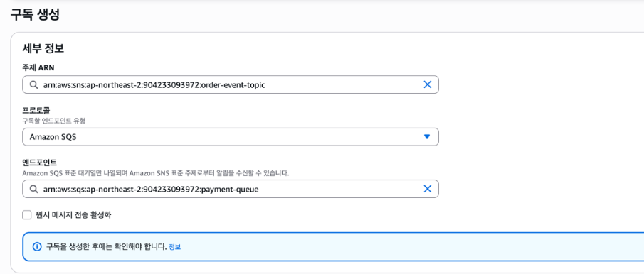

**Payment Queue 구독:**
- **Protocol**: **Amazon SQS** 선택
- **Endpoint**: `payment-queue` 선택
- **"Create subscription"** 클릭

**Stock Queue 구독:**
- **Protocol**: **Amazon SQS**
- **Endpoint**: `stock-queue` 선택
- **"Create subscription"** 클릭

**Notification Queue 구독:**
- **Protocol**: **Amazon SQS**
- **Endpoint**: `notification-queue` 선택
- **"Create subscription"** 클릭

5. **Subscriptions** 탭에서 3개의 구독이 모두 **Confirmed** 상태인지 확인

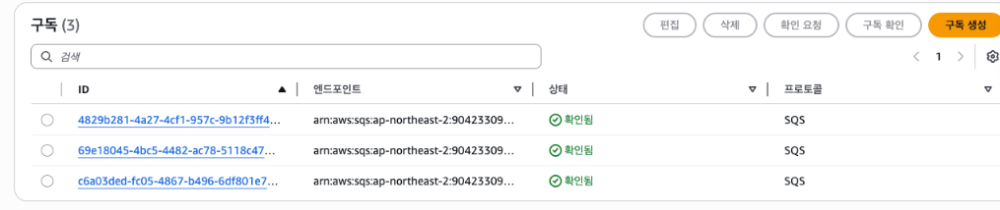

### 환경변수 설정

각 서비스의 Run Configuration에서 환경변수 설정
IntelliJ IDEA 우측 상단 애플리케이션 클릭

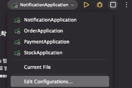

**Edit Configurations** 선택 -> **Environment variables** 클릭

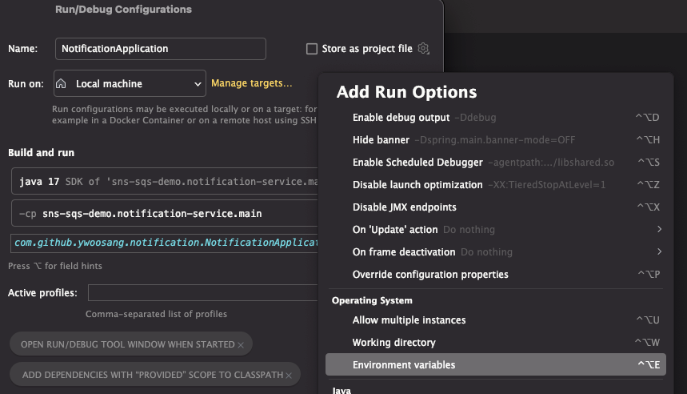

각 서비스 폴더 루트에 있는`.env.example` 파일의 내용을 채우고 복사하여 붙여넣기

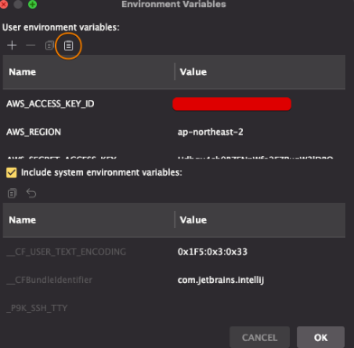

---

## 5. 테스트

각 서비스를 독립적으로 실행

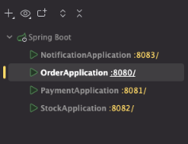

모든 서비스가 실행되면 주문을 생성하여 테스트

```bash
curl -X POST http://localhost:8080/api/orders \
  -H "Content-Type: application/json" \
  -d '{
    "userId": "user123",
    "productId": "product456",
    "quantity": 2,
    "totalAmount": 50000.0
  }'
```

주문 마이크로서비스에서 SNS에 메시지를 전송하는지 확인

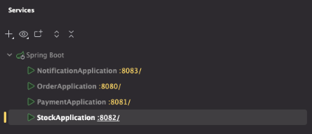

주문 서비스 콘솔에서 SNS 발행 로그 확인

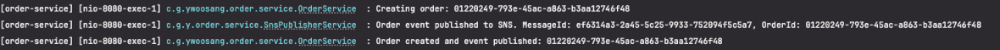

결제, 재고, 알림 마이크로서비스에서 SQS Consumer를 통해 메시지를 Polling 받아 정상적으로 처리하는지 확인

**Payment Service 로그:**
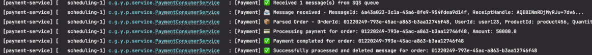

**Stock Service 로그:**
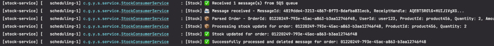

**Notification Service 로그:**
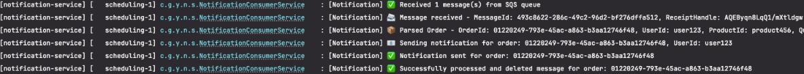